# Keypr — Desktop Client

> Repository containing the code of the desktop application.

Keypr is a cross-platform password manager built with Qt6/C++. This repository holds the desktop client (UI, controllers, forms) and pulls in [`keypr-core`](https://github.com/Keypr-org/core) as a git submodule for vault encryption, decryption and parsing. Vaults are encrypted locally with `libsodium`; nothing about your secrets is sent anywhere unless you explicitly enable a feature (e.g. email aliases) that requires it.

## Table of Contents

- [Keypr — Desktop Client](#keypr--desktop-client)
  - [Table of Contents](#table-of-contents)
  - [Features](#features)
  - [Project Structure](#project-structure)
  - [How to Use](#how-to-use)
    - [Creating and unlocking a vault](#creating-and-unlocking-a-vault)
    - [Managing entries](#managing-entries)
    - [Personas](#personas)
    - [Password generator](#password-generator)
    - [Using email aliases](#using-email-aliases)
  - [How to Build from Source](#how-to-build-from-source)
    - [First time cloning the repository](#first-time-cloning-the-repository)
    - [Updating the repository and its submodules](#updating-the-repository-and-its-submodules)
    - [Automatically updating the submodules when pulling](#automatically-updating-the-submodules-when-pulling)
    - [Updating the submodules in the repository](#updating-the-submodules-in-the-repository)
    - [Dependencies](#dependencies)
    - [Build steps](#build-steps)
    - [Running the tests](#running-the-tests)
  - [Native Messaging](#native-messaging)
    - [Host installation](#host-installation)
    - [qt_client request flow](#qt_client-request-flow)
  - [Contributions and Workflow](#contributions-and-workflow)
    - [Contributing](#contributing)
    - [Workflow of the project](#workflow-of-the-project)
      - [Example of a versioned tag: `v1.0.2`](#example-of-a-versioned-tag-v102)
  - [AI Usage](#ai-usage)

## Features

- **Encrypted vaults** — create one or several vaults, each unlocked with its own master password (`keypr-core` handles the crypto, backed by `libsodium`).
- **Categorized entries** — organize secrets as Website, Credit Card and WiFi entries inside categories.
- **Personas** — generate and reuse fake identities (name, address, etc.) when filling out web entries.
- **Password generator** — generate strong passwords with a live password-strength indicator.
- **Email aliases** — generate disposable email aliases for Website entries through the [Postscale](https://postscale.io) service.
- **Cross-platform** — builds and ships for Windows, macOS and Linux via the project's CI/CD pipeline.

| | |
|---|---|
| **Vault selection**<br>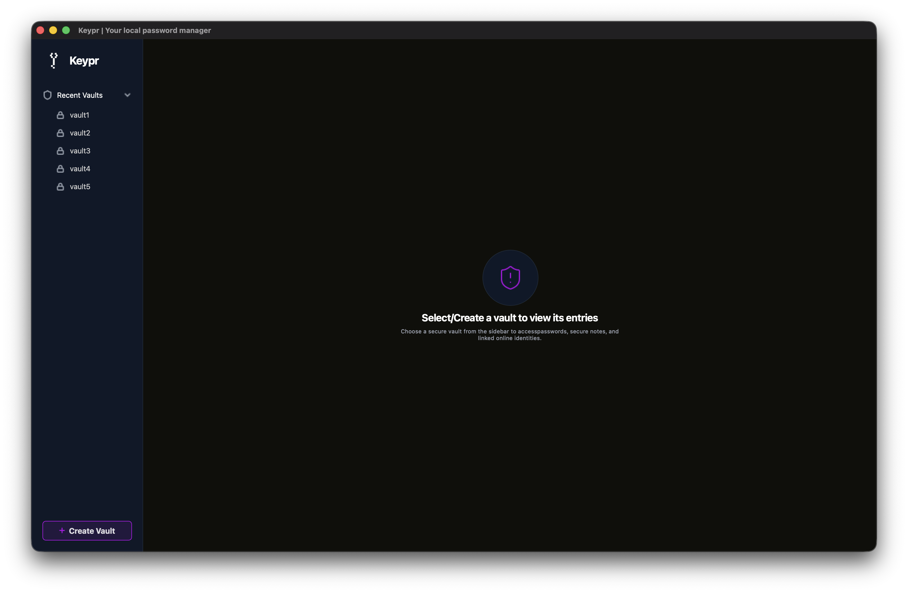 | **Vault unlock**<br>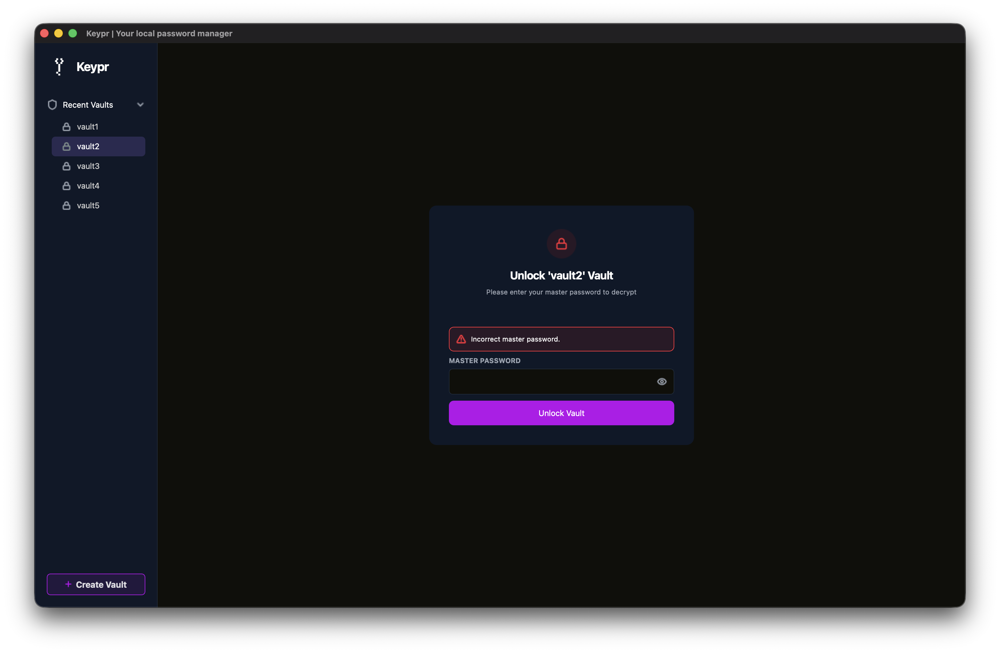 |
| **Category list**<br>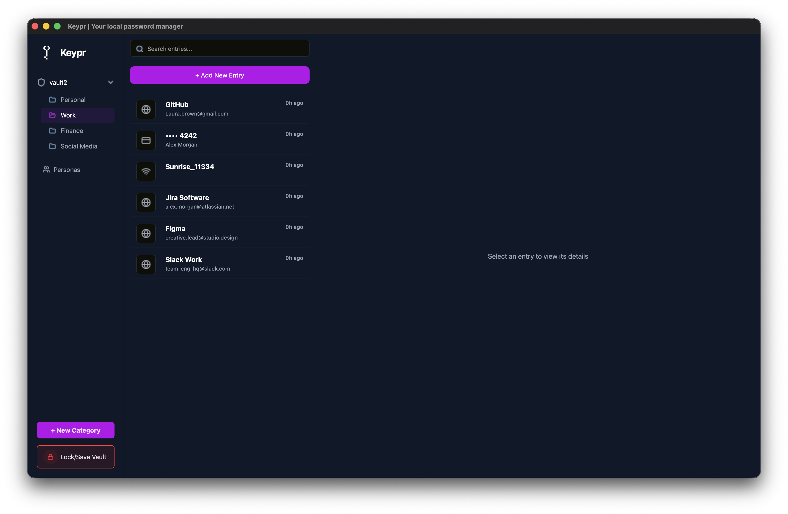 | **Create a vault**<br>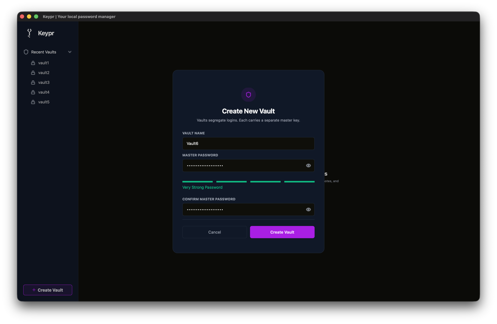 |
| **Create an entry**<br>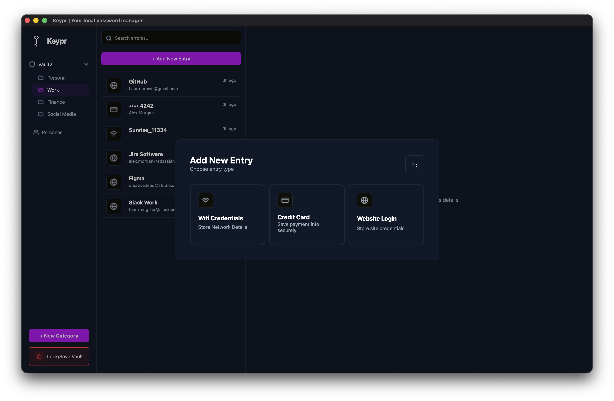 | **Website entry**<br>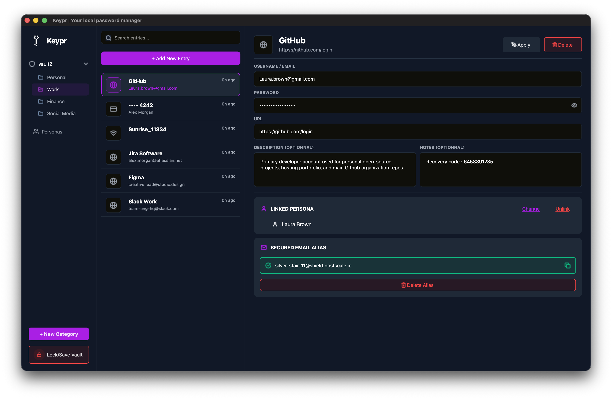 |
| **Create website entry**<br>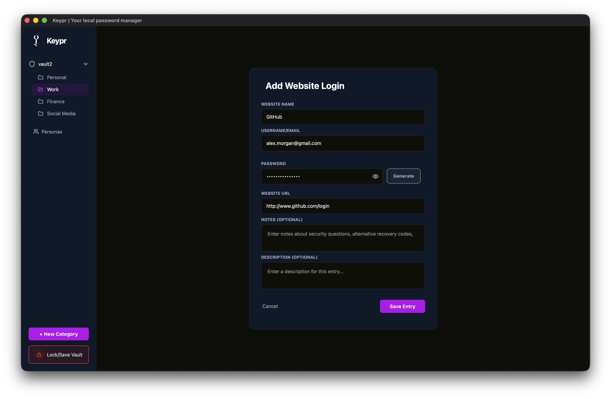 | **Card entry**<br>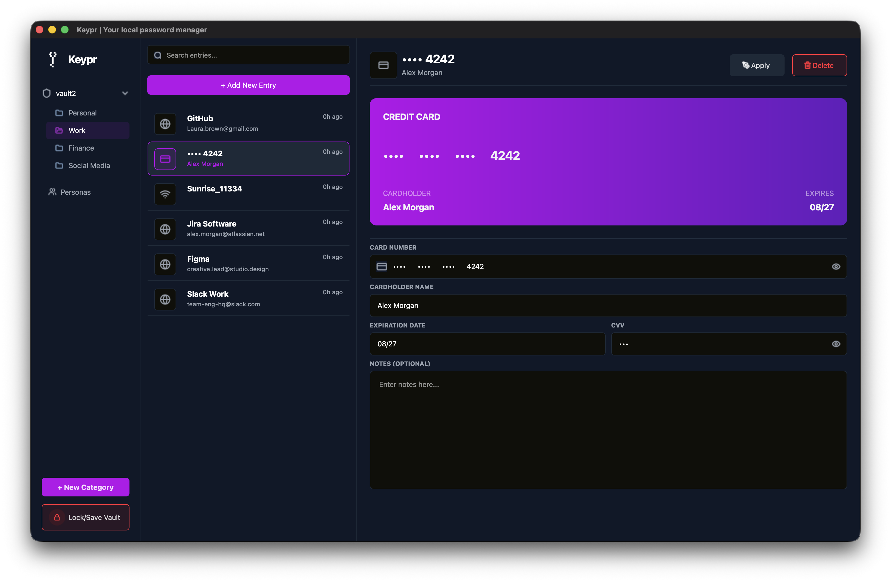 |
| **Create card entry**<br>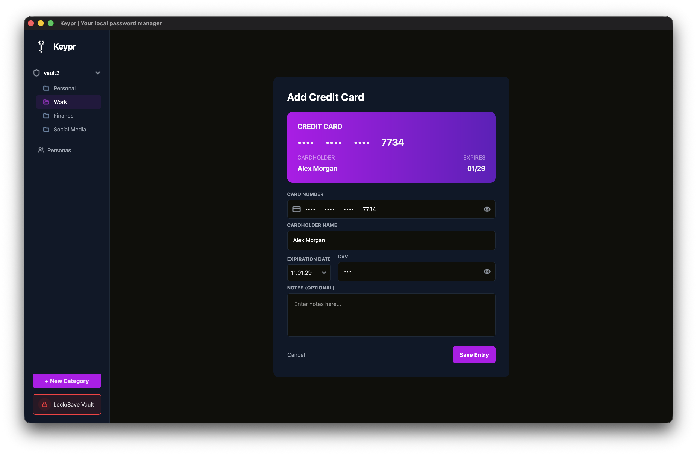 | **WiFi entry**<br>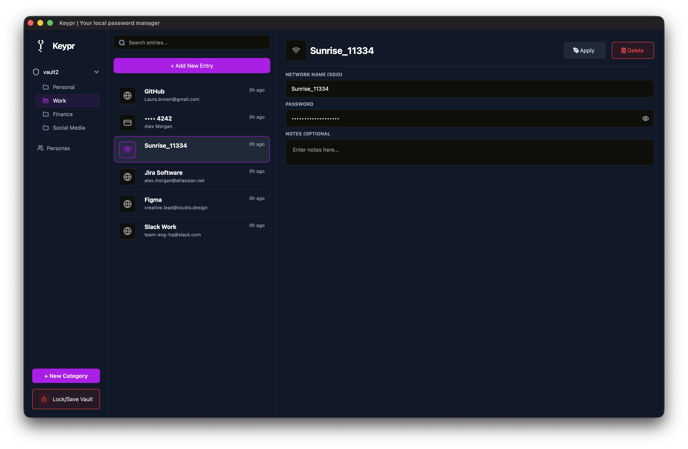 |
| **Create WiFi entry**<br>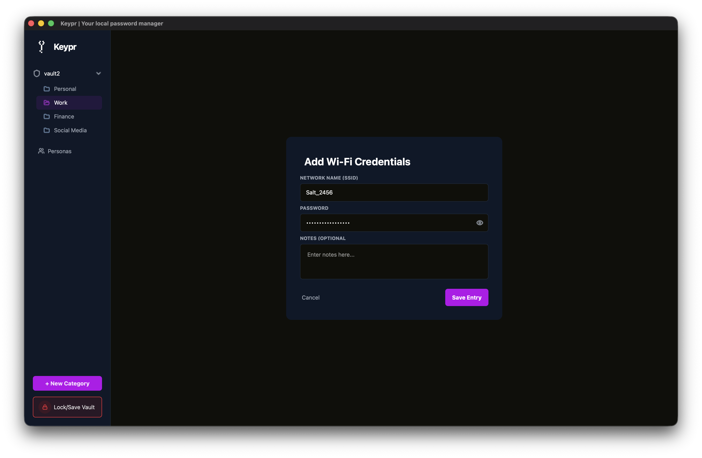 | **Password generator**<br>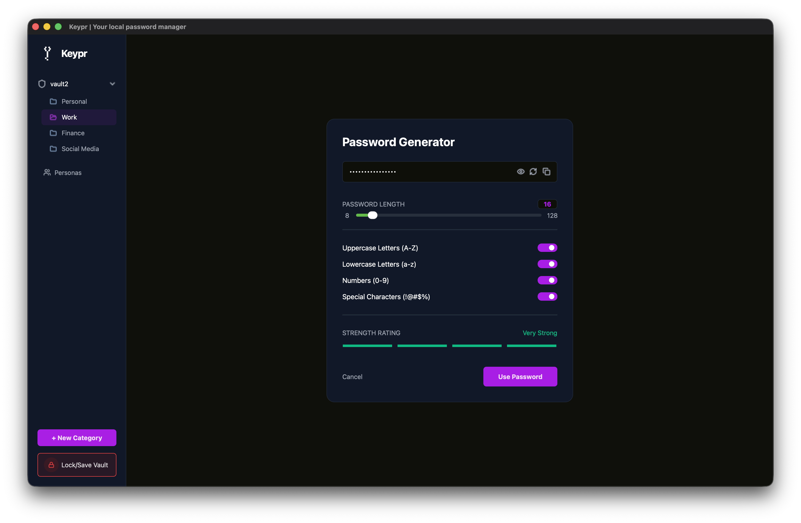 |
| **Personas**<br>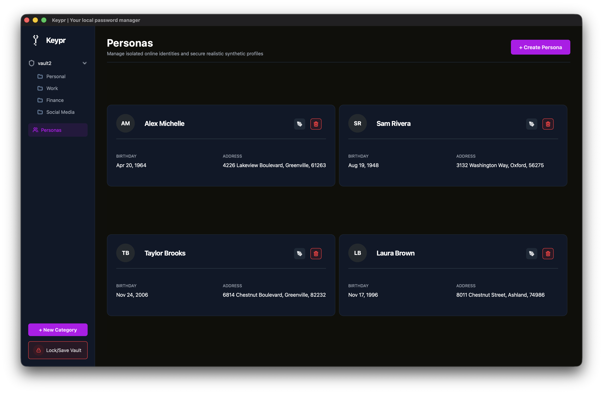 | **Create persona**<br>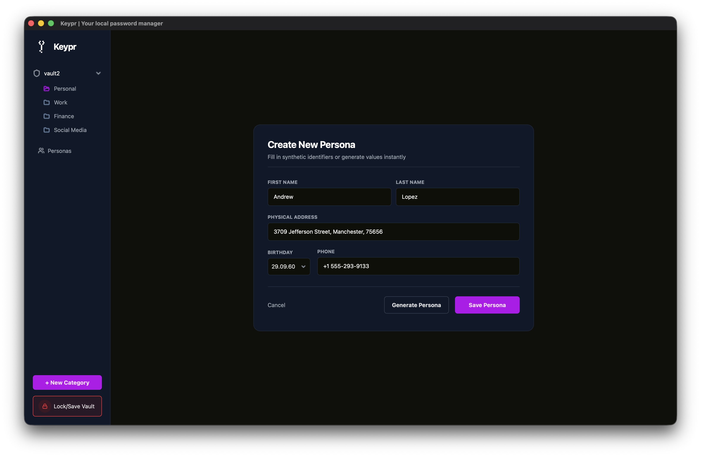 |

## Project Structure

```
qt_client/
├── CMakeLists.txt          # Top-level build definition (qt_client target)
├── CMakePresets.json        # CMake presets (toolchain, generator, ...)
├── vcpkg.json               # Client dependencies (gtest, libsodium, nlohmann-json)
├── resources.qrc            # Qt resource file (icons, images)
├── icons/                   # Icon assets used throughout the UI
├── resources/
│   ├── logo.png
│   └── screenshots/          # Screenshots used in this README
├── keypr-core/               # Git submodule: vault encryption/decryption/parsing library
│   ├── include/               # Public headers of keypr-core
│   ├── src/                   # Implementation of keypr-core
│   └── tests/                 # keypr-core unit tests
├── src/
│   ├── main.cpp                 # Application entry point
│   ├── mainwindow.*              # Main window shell
│   ├── vaultcontroller.*         # Vault lifecycle (create/unlock/lock, entries CRUD)
│   ├── mailaliasclient.*         # HTTP client for the Postscale API
│   ├── mailaliascontroller.*     # Business logic wiring the alias client to the UI
│   ├── appconfig.* / jsonfileconfig.*   # Application configuration (JSON-backed)
│   ├── vaultstoragesetupdialog.* # First-run vault storage location setup
│   ├── component/                # Reusable UI widgets (inputs, cards, list items, tooltips, toggle switch...)
│   ├── formOverlay/               # Modal overlays (create vault, create category, new entry, edit persona)
│   ├── mainContent/                # Main content area screens
│   │   └── entries/                  # Per-entry-type widgets (website, credit card, wifi)
│   ├── sideBar/                    # Sidebar widgets (vault selection, category selection)
│   ├── settings/                   # Settings window
│   └── utils/                      # Small helpers (card number formatting, password strength, random persona, hover/clickable widgets)
├── tests/                    # Qt client unit tests (vault controller, mail alias controller)
└── .github/workflows/        # CI/CD: build-and-test.yml, package-for-release.yml
```

## How to Use

### Creating and unlocking a vault

1. On first launch, choose where vault files should be stored.
2. Create a new vault and set its master password.
3. Select the vault and unlock it with its master password to access its entries.

### Managing entries

Inside an unlocked vault, create categories and add entries of type **Website**, **Credit Card** or **WiFi**. Entries can be edited, copied to clipboard and deleted from the category view.

### Personas

Use the Personas panel to generate reusable fake identities, which can then be picked when filling out a Website entry's form fields.

### Password generator

Open the password generator from a form to create a strong password; the generator shows a live strength indicator before you apply it to the field.

### Using email aliases

Email aliases use the [Postscale](https://postscale.io) service. To generate an alias:

1. Register with Postscale.
2. Follow Postscale's **Getting Started** instructions through the **Adding a domain** step.
3. Obtain your API key and the destination address to which aliases should forward mail.
4. Enter both values in Keypr's **Settings** window.
5. Open a Website entry and choose **Generate alias**.

This feature requires network access to Postscale; vault data is otherwise processed locally.

## How to Build from Source

### First time cloning the repository

```bash
# HTTPS
git clone --recurse-submodules https://github.com/Keypr-org/qt_client.git
# SSH
git clone --recurse-submodules git@github.com:Keypr-org/qt_client.git
```

### Updating the repository and its submodules

```bash
git pull --recurse-submodules
git submodule update --init --recursive
```

### Automatically updating the submodules when pulling

You can alternatively configure git to automatically update the submodules when pulling:

```bash
git config --global submodule.recurse true
```

### Updating the submodules in the repository

```bash
git submodule update --remote --merge
git add keypr-core # Assuming the submodule is located in the keypr-core folder
git commit -m "[Fix]: Update submodule keypr-core"
git push
```

### Dependencies

- CMake >= 3.21 (required by the `keypr-core` submodule; a recent CMake is
  recommended for the presets below)
- A C++20 compiler
- Qt6 >= 6.5 (Widgets, Test, Network components)
- [vcpkg](https://learn.microsoft.com/en-us/vcpkg/get_started/get-started?pivots=shell-bash), used to fetch `gtest`, `libsodium` and `nlohmann-json`

The CMake presets expect `VCPKG_ROOT` to point to the vcpkg installation. The
repository pins the vcpkg registry baseline in
[`vcpkg-configuration.json`](vcpkg-configuration.json), so use a checkout of
vcpkg with manifest mode enabled rather than installing dependencies globally.
Qt is found through the normal CMake/Qt installation mechanisms; the CI
workflow installs Qt before configuring the project.

### Configure vcpkg

If vcpkg is not installed, clone it and bootstrap it by following the
[official installation procedure](https://learn.microsoft.com/en-us/vcpkg/get_started/get-started):

```bash
# Linux/macOS
git clone https://github.com/microsoft/vcpkg.git "$HOME/vcpkg"
"$HOME/vcpkg/bootstrap-vcpkg.sh"
export VCPKG_ROOT="$HOME/vcpkg"
```

On Windows, clone the repository, run `bootstrap-vcpkg.bat`, and set
`VCPKG_ROOT` to the vcpkg directory. For PowerShell:

```powershell
git clone https://github.com/microsoft/vcpkg.git "$HOME\vcpkg"
& "$HOME\vcpkg\bootstrap-vcpkg.bat"
$env:VCPKG_ROOT = "$HOME\vcpkg"
```

To keep `VCPKG_ROOT` across terminal sessions, add it to your shell profile
(`~/.profile`, `~/.zshrc`, or the Windows environment variables). The first
CMake configure/build command automatically installs the dependencies declared
in [`vcpkg.json`](vcpkg.json) into the vcpkg manifest build tree.

### Build steps

The repository provides configure, build, test and workflow presets in
[CMakePresets.json](CMakePresets.json). Set `VCPKG_ROOT` first, then run the
complete debug workflow (configure, build and test) or the release workflow:

```bash
# Debug workflow: configure, build and test
cmake --workflow --preset default

# Release workflow: configure and build, without tests
cmake --workflow --preset release
```

To run individual preset steps instead:

```
cmake --preset debug
cmake --build --preset debug
ctest --preset default
```

You can also build in Qt Creator by opening `CMakeLists.txt` and configuring
the project with the vcpkg toolchain file:
`Projects` > `Build & Run` > your kit > `CMake` > `CMake Toolchain File`.

The post-build step generates and registers the Native Messaging host manifest.
If no supported Chromium-based browser profile exists yet, CMake prints a
warning; build again after installing or creating the browser profile.

### Running the tests

The debug workflow builds the two qt_client Qt Test executables and the
`keypr-core` tests. Run the configured test preset, or run CTest directly from
the debug build directory:

```bash
ctest --preset default
# equivalent:
ctest --test-dir build/debug --output-on-failure
```

## Native Messaging

Keypr supports [Chromium Native Messaging](https://developer.chrome.com/docs/apps/nativeMessaging/)
for the browser extension. The host name is `com.keypr.native`, and the
generated manifest allows only the extension origin
`chrome-extension://lfmecfelolhliggpdajjbpciggaapmgb/`. Firefox is not registered
by the current installer.

> **Known Windows limitation:** Native Messaging currently does not work on
> Windows. Chromium-based browsers on Windows refuse to launch `qt_client`,
> which is a GUI executable, as a Native Messaging host. This is a known issue
> and has not been fixed yet.

### Host installation

Every successful build runs `installer/register_native_host.cmake` as a
post-build step. It generates a manifest from
`installer/native-messaging/com.keypr.native.json.in`, replacing its `path`
with the built executable:

- **Windows:** copies the manifest beside `qt_client.exe` and registers that
  file in the per-user registry locations used by supported Chromium-based
  browsers. The host still cannot be launched by those browsers because of the
  Windows GUI-executable limitation above.
- **Linux:** installs it under `NativeMessagingHosts` in each detected browser
  configuration directory under `$XDG_CONFIG_HOME` (or `~/.config`).
- **macOS:** installs it under each detected browser's
  `NativeMessagingHosts` directory in `~/Library/Application Support`.

The browser must have the extension installed and its origin must match the
manifest. On Linux and macOS, the executable must remain at the manifest's
`path`; rebuilding updates the manifest to the new build path.

### qt_client request flow

1. When the extension calls `chrome.runtime.connectNative("com.keypr.native")`,
   the browser starts a new `qt_client` process and connects the host's
   standard input/output pipes to the browser.
2. `main.cpp` first tries to connect to the local server
   `com.keypr.native.instance`. If no primary process answers within 200 ms,
   this process becomes the primary instance, creates the normal Keypr window,
   starts the Native Messaging reader and starts the local server.
3. If a primary process is already running, the newly started process becomes a
   bridge. It does not create a window. `NativeMessageBridge` forwards framed
   messages between the browser's stdio and the primary process over a
   `QLocalSocket`, then exits when either side disconnects.
4. `NativeMessaging` reads and writes the browser pipe. Each message is framed
   with a 4-byte unsigned little-endian length followed by that many bytes of
   JSON. Reads run on a worker thread; writes are mutex-protected and flushed
   immediately. Messages larger than 1 MiB are rejected.
5. The primary `NativeMessageDispatcher` parses the JSON and handles:

   | Request | Required field | Response |
   |---|---|---|
   | `{"type":"GET_ENTRIES","url":"https://example.com"}` | `url` | `{"type":"ENTRIES","entries":[{"id":"...","username":"..."}]}` |
   | `{"type":"GET_PASSWORD","id":"..."}` | `id` (string) | `{"type":"PASSWORD","password":"..."}` |

   Invalid JSON, unknown request types, a locked vault, and lookup failures
   produce `{"type":"ERROR","code":"..."}` responses. `GET_ENTRIES` matches
   the URL host against Website entries; `GET_PASSWORD` returns the password
   for the selected Website entry ID. The dispatcher never unlocks a vault or
   stores credentials itself; it uses the existing `VaultController`.

## Contributions and Workflow

### Contributing

Contributions are welcome! Please read our contribution guidelines before submitting a pull request.

### Workflow of the project

This repository uses two GitHub Actions workflows:
[build-and-test.yml](.github/workflows/build-and-test.yml) validates changes,
while [package-for-release.yml](.github/workflows/package-for-release.yml)
builds distributable archives and publishes releases.

**Build and test (`build-and-test.yml`):**

- Runs on pushes and pull requests targeting `develop`, and can also be
  started manually.
- Builds and tests Linux x64, Windows x64 and macOS arm64 configurations.
- Uploads un-packaged build artifacts; this workflow does not publish a release.

**Packaging and release (`package-for-release.yml`):**

- Runs on pushes to `main`, pushes of tags matching `v*`, pull requests
  targeting `main`, and manual dispatches.
- Builds and tests Linux x64, Windows x64 and macOS arm64. It packages an
  AppImage for Linux and ZIP archives for Windows and macOS.
- A push to `main` updates the rolling pre-release tagged `latest-main`.
- A pushed version tag creates an official release with the same tag and
  uploads the three platform archives. Pull requests build and test, but do not
  publish releases.

#### Example of a versioned tag: `v1.0.2`

```bash
# This creates v1.0.2 and pushes it, causing the packaging workflow to create
# a release and attach the platform archives.
git tag v1.0.2 && git push origin --tags
```

## AI Usage

Parts of this project's documentation and/or code have been assisted by AI
tools. AI-assisted contributions are carefully reviewed before being merged,
like any other contribution. AI has mainly been used for research, pull
request summaries and documentation.
